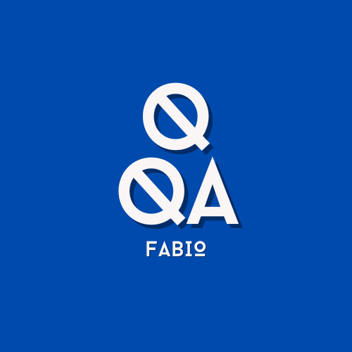

  

<h1 style="color: white; font-family: 'Fira Code Retina',serif">Olá, meu nome é Fábio Morais</h1>

Sou Analista de Qualidade de Software (QA) e apaixonado pela área. Trabalho com metodologia ágil (scrum), sou atento a detalhes para testes e documentações, capacidade analítica para definir qual o tipo de teste ideal a ser utilizado, resiliência, proatividade e organização. Conhecimento em automatização de testes de front-end, API e unitários. Minha abordagem focada na qualidade e inovação é essencial para a equipe, impulsionando uma cultura de qualidade contínua.

<h3>
Ferramentas que utilizo/já utilizei</h3>

  
  
  
  
  
  
  
  
  
  
  
  
  
  
  

<h3>
Linguagens que utilizo/já utilizei</h3>

  
  
  
---

<h3>
Postagens recentes</h3>

<ul>
  <li><a href="https://medium.com/@fabiomoraisassuncao/manifesto-do-teste-ágil-7784d3178afd"><b>QA | Capítulo 2 — Manifesto do Teste Ágil</b></a> <i>Manifesto do Teste Ágil.</i></li>  
  <li><a href="https://medium.com/@fabiomoraisassuncao/qa-capítulo-1-lâmpada-9346ac1d6a4f"><b>QA | Capítulo 1 — Lâmpada</b></a> <i>Casos de Testes.</i></li>
  <li><a href="https://medium.com/@fabiomoraisassuncao/wrapper-6097b986de68"><b>Python | Capítulo 2 — Wrapper</b></a> <i>Design Patterns.</i></li>
  <li><a href="https://medium.com/@fabiomoraisassuncao/frontend-com-python-1a6ec2b5b9dc"><b>Python | Capítulo 1 — Frontend com Python?</b></a> <i>Conheça o PyScript.</i></li>
</ul>

---
  
